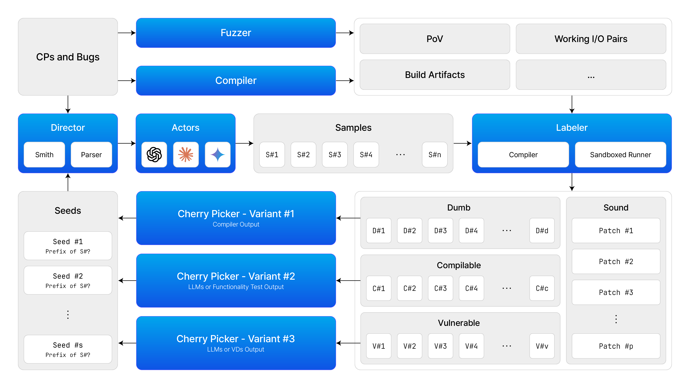

# Loop



*Loop* is a patch circuit that iteratively generates patch candidates, inspired by the code generation process of CodeRL.

## Usage

### Installation

```bash
poetry install
```

## Development Guidelines

### Static Analysis

**It is highly recommended to use `pyright` instead of `mypy`.** Refer to the [official comparison document](https://github.com/microsoft/pyright/blob/main/docs/mypy-comparison.md) for more details. If you are using Visual Studio Code with the Python extension, simply enable `Type Checking: strict` option, which utilizes pyright.

### Immutable by Default

Strive for immutability everywhere, except for intentional and carefully considered cases of mutability.

### Context Management

```python
>>> def first(limit: int) -> RequiresContext[bool, str]:
...     def inner(deps: str) -> bool:
...         return len(deps) > limit
...     return RequiresContext(inner)  # wrapping function here!

>>> assert first(1).map(bool_to_str)('abc') == 'ok'
>>> assert first(5).map(bool_to_str)('abc') == 'nope'
```

Extend contexts rather than adding parameters. The *RequiresContext* monad, a relaxed-reader monad, binds the context when the act function is called. This monad provides the necessary information for implementing the business logic within the function. Check [this document](https://returns.readthedocs.io/en/latest/pages/context.html) for detail.

### Linting

Use `black` and `isort` for formatting.

### Unit Test

```bash
poetry run pytest
```
