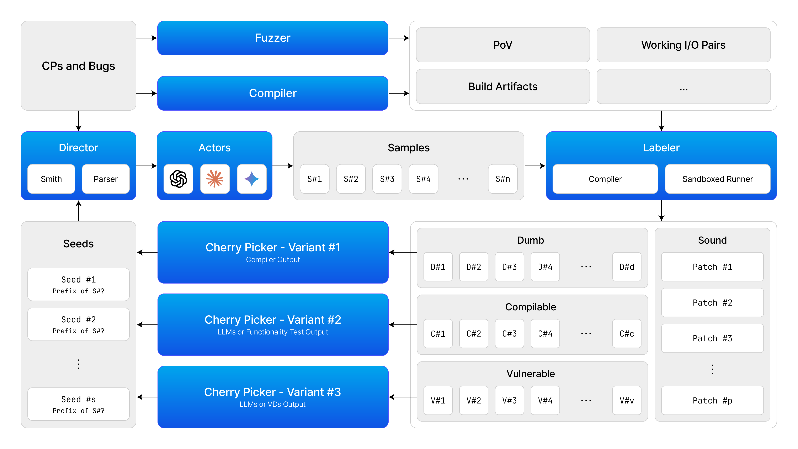

# Proposal: Loop

## Introduction

### Motivation: CodeRL

![Overview of our Critic Sampling approach for program synthesis during inference: (1) For each test problem, we first use finetuned LM to generate a set of solution programs. (2) From the problem description, we extract example unit tests and test against generated solutions. (3a) If there are any passed solutions, we pass them to the critic model to sample sub-sequences. (4a) The sub-sequences from (3a) are used as seed sequences to condition the LM to regenerate solution programs, repeating the steps from (1) onward. (3b) If there are no passed solutions from (2), we pass current solutions to the critic model to select the best candidates. (4b) These candidates from (3b) are passed to a program repair model, together with their error types and compiler error messages. We repeat the same steps as (2) onward. Dotted lines indicate optional processes that apply during program refining or repairing.](./proposal-figure-code-rl-generation.png)

*CodeRL* is a reinforcement learning framework that applies unit tests to an Actor-Critic model to solve a given problem.

The code generation process of *CodeRL* is as follows:

1. Actor generates N code samples:
    - The Actor is a neural network that generates code samples. The N code samples are generated based on the problem description and the current state of the environment.
1. The code samples are classified through unit tests:
    - The unit tests are used to evaluate the correctness of the code samples. A code sample is classified as "unit test passed" if it passes all of the unit tests. A code sample is classified as "unit test failed" if it fails at least one of the unit tests.
1. For the samples that passed the unit tests, sub-sequencing is performed based on the scores of the Critic model for each sample:
    - The Critic is a neural network that assigns scores to code samples. The scores are based on the likelihood that the code sample will solve the problem. Sub-sequencing is a process of breaking a code sample down into smaller sequences. The sub-sequences are ranked based on the scores of the Critic model. Note that the Critic model can assign scores at the token level.
1. The subsequences are considered seeds and shown to the Actor:
    - The Actor uses the subsequences as seeds to guide its generation of new code samples, aiming to complete the code based on these promising starting points.
1. The process continues until the condition is met according to the policy:
    - The policy determines when to stop based on a combination of factors, including the results of the unit tests and the number of iterations.

Overall, *CodeRL* is a powerful framework for solving programming problems using reinforcement learning. The Actor-Critic model allows *CodeRL* to learn from its mistakes and improve its performance over time. The use of unit tests ensures that the generated code is correct. Sub-sequencing helps *CodeRL* to focus on the most promising parts of the code. And the policy ensures that the code generation process is efficient and effective.

### Suggestion: Loop

*Loop* is a patch circuit that iteratively generates patch candidates, inspired by the code generation process of CodeRL.

Like *CodeRL*'s Actor that refines code based on Critic's feedback and unit test results, Loop can leverage various feedback mechanisms, such as fuzzers or vulnerability detectors (VDs), to improve its patch suggestions. This iterative approach allows Loop to explore a wider range of potential solutions and identify effective patches for the program.

## Loop

### Overview

The Loop patch generation process works as follows:

1. The *Actor* generates *samples* based on given scene.
1. These *samples* are evaluated by a *Labeler*, such as a fuzzer or VDs, to determine if they fix the issue and maintain functionality.
1. *Seeds*, the promising subsequences of each *labeled sample*, are identified from the passing samples by the *Cherry pickers*.
1. The *Actor* uses these *seeds* to guide the generation of new code *samples*, similar to code completion tasks.
1. Repeat the above stages until sound code is generated or the maximum iteration count is reached.

### Director and Scene

The *scene*, generated by the *director*, acts as a blueprint for the *Actor*, the code-fixing component. It provides key information about the bug:

- **File**: This specifies the source code file where the bug resides.
- **Location**: This pinpoints the exact location, often including the function name where the bug occurs.
- **Instruction**: This clearly states the goal. A well-written instruction might look like: "Fix the bug in the `function_name` function from the given code:"

#### Question: How to Enhance the Scene?

While the current *scene* provides the essentials, can we add even more information to guide the *Actor* more effectively?

- **Smith**: Some localization data from *Smith* would be beneficial for improve the quality of the scene.
- **Fuzzer Data**: Information from fuzzers, like identified crashes or unexpected outputs, could be included. This helps the *Actor* understand the problem's symptoms and target the root cause.
- **Vulnerability Details**: Data from VDs could be valuable. This could include the specific lines of code involved, allowing the *Actor* to prioritize safe solutions.

### Actor and Samples

The *Actor* is a crucial player in Loop. Think of it as a code-fixing factory. It leverages the power of LLMs like Claude, ChatGPT, or Gemini.

The *Actor*'s primary function is to generate multiple code *samples*, each representing a potential fix for the bug in the provided code. By generating a diverse set of *samples*, the system explores a wider range of solutions, increasing the chances of finding an effective patch.

#### Question: Ensemble

What about employing multiple LLMs to generate a variety of *samples*?

### Labeler and Labeled Samples

The *Labeler* plays a crucial role in evaluating the code samples generated by the *Actor*. It analyzes each sample based on three key aspects:

- **Compilability**: Does the code compile without errors?
- **Functionality**: Does the code address the intended functionality as defined by the problem? Functionality tests, often relying on input-output pairs generated by fuzzers, can help ensure the code doesn't introduce crashes.
- **Safety**: Does the code introduce any new vulnerabilities or security risks?

Based on this evaluation, the *Labeler* assigns a category to each sample:

- **Dumb**: These samples likely have syntax errors or other issues that prevent them from compiling or functioning correctly.
- **Compilable**: These samples compile successfully, but it's unclear if they address the intended functionality.
- **Vulnerable**: These samples might compile and appear functional, but they contain security vulnerabilities.
- **Sound**: This category could be added to represent samples that pass all three criteria (compile, function correctly, and are secure).

|  | Compilable | Functionality | Safety |
|:--:|:--:|:--:|:--:|
| Dumb | X | - | - |
| Compilable | O | X | - |
| Vulnerable | O | O | X |
| Sound | O | O | O |

### Cherry Picker and Seeds

*Cherry pickers* identify promising code sections (subsequences) from the samples that pass the initial evaluation. These subsequences, then referred to as *seeds*, serve as starting points for the *Actor* to refine the code further. The cherry picking strategy varies depending on the category of the sample:

- **Dumb Samples**: These are likely non-functional. *Cherry pickers* focus on identifying prefixes that compile before encountering errors.
- **Compilable Samples**: These compile but might not address the issue. *Cherry pickers* aim to find the longest prefix before the code breaks functionality using LLMs via prompting. Alternatively, minimal common paths identified through functionality tests can be used as seeds.
- **Vulnerable Samples**: Here, the goal is to guide the *Actor* towards a safe solution. *Cherry pickers* can prompt LLMs to directly suggest secure prefixes. Alternatively, vulnerability detectors can pinpoint the buggy line, and the prefix before that line can be used as a seed. It's important to note that this approach cannot cover situations where the buggy location and the patch location differ.

#### Question: Local Critic Model

*CodeRL* relies on a powerful local model called the *Critic*. Unlike traditional code analysis tools, the *Critic* doesn't require a complete code snippet. Instead, it analyzes code at the token level (individual pieces) and predicts potential outcomes based on those tokens. The *Critic* can predict the possibilities of compilation failure, runtime failure, unit test failure, and soundness.

The authors report that the *Critic* could be a small model. If we could use a simple quantized Seq2Seq model as the *Critic* within a sandbox, could it be a promising option?

#### Question: Prompts

If we use LLMs for cherry-picking samples, what information could be included in prompts?

## DevOps

### Objective

We aims to create a framework where anyone can contribute features, regardless of their technical expertise. This means that:

- **Contributors don't need to understand the inner workings of the framework to add new functionalities.**
- **The framework is designed for easy extension**, allowing for seamless integration of new features.
- **Examples of such frameworks include Django and Flask**, which enable developers to focus solely on business logic without delving into the framework's intricate details.

### Methods

To achieve this objective, DevOps emphasizes the separation of framework implementation from business logics. This is accomplished through:

- **Dependency injection-based frameworks:** These frameworks hide complex logic through Inversion of Control, allowing feature developers to focus on functionality without getting bogged down in framework internals.
- **Clear separation between framework maintainers and feature developers:** Framework maintainers build the core architecture, while feature developers concentrate on functionalities. This empowers all developers and streamlines development.

By adopting these principles, these methods empowers developers of all skill levels to contribute to software development, fostering a more collaborative and efficient development process

### Milestones

#### Phase 1: Lay the groundwork

- Establish a foundational framework for the circuit.
- Validate the circuit's functionality using simulated services.

#### Phase 2: Generate a Compilable Patch

- Implement a MVP for the patching functionality.
- Only focus on ensuring the patch can be successfully compiled.

#### Phase 3: Building a Sound Patch

- Develop a comprehensive set of patching services.
  - Explore collaboration to integrate fuzzing tools and virtual devices (VDs) for enhanced testing.
- Evaluate and refine the generated patch candidates to ensure their correctness.
